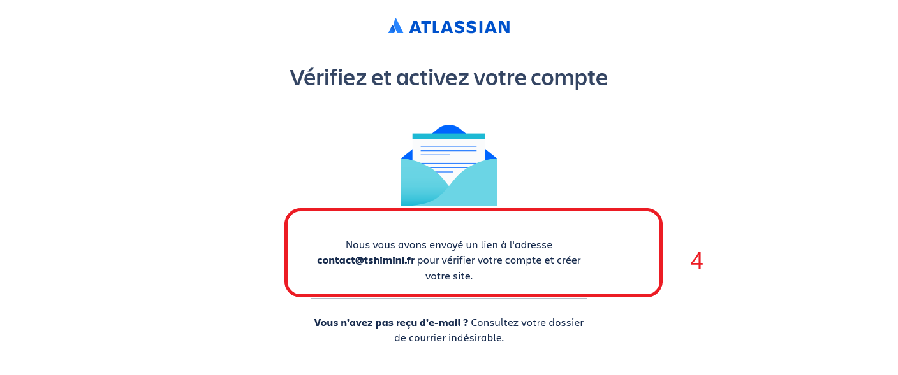
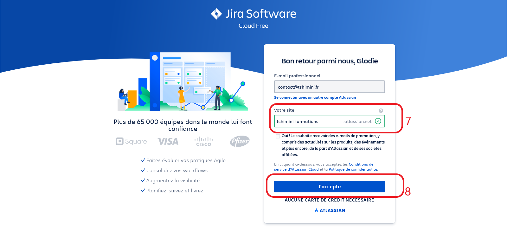
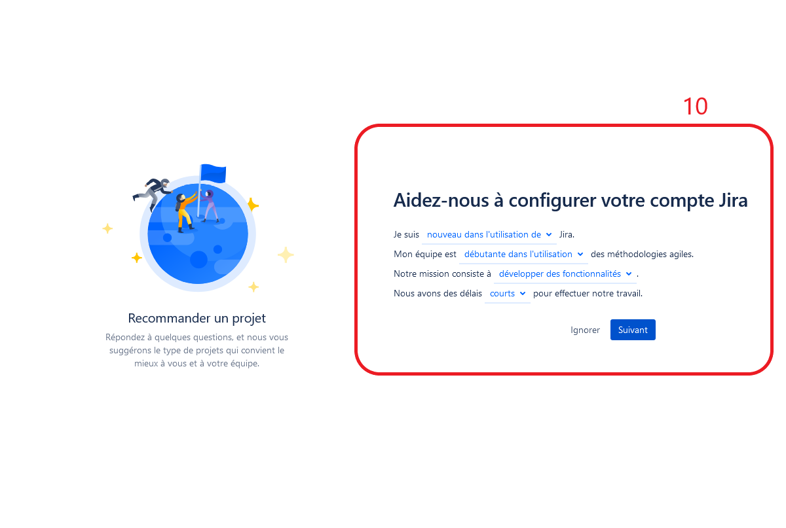

# Jira

Logiciel de gestion de projet agile.

## Mise en place

1. Dans chaque groupe, désignez un responsable qui aura le rôle du *SCRUM Master* durant toute la série des exercices.
2. Les autres membres de l'équipe (tous les autres en dehors du *SCRUM Master*) doivent créer un compte à partir du [lien suivant](https://id.atlassian.com/signup)

### SCRUM Master : création projet Jira

1. Le *SCRUM Master* va créer un projet Jira depuis ce [lien](https://www.atlassian.com/fr/software/jira/free) en suivant les indications du site et en s'appuyant sur les captures d'écran ci-après.
2. A la fin de la création du projet :
- Invitez les autres membres du groupe en saisissant leurs adresses e-mails pour participer au projet
- Ajoutez l'extension *Story mapping*

- Ajoutez l'extension *Planning Poker*

#### Illustrations création d'un compte et d'un projet Jira

