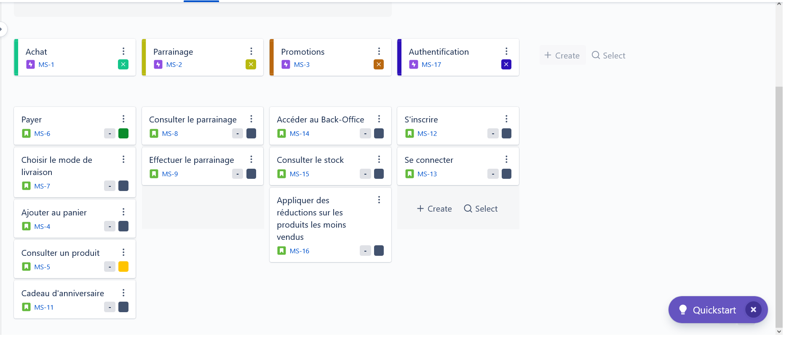

# Correction exercice 2 : proposition du Backlog

## Rappels des besoins

- Cadeau d'anniversaire pour un client qui effectue un achat le jour de son anniversaire.
- Parrainage avec des récompenses pour le filleul et le parrain.
- Offres promotionnelles sur les produits les moins vendues.

## Epic

- Cadeau d'anniversaire pour un client qui effectue un achat le jour de son anniversaire => *Achat*
- Parrainage avec des récompenses pour le filleul et le parrain => *Parrainage*
- Offres promotionnelles des produits les moins vendues. => *Promotions*

Dans *Achat*, tous les *US* concernant l'authentification (inscription, connexion etc.) peuvent être regroupé dans un epic à part nommé *Authentification*.

La réalisation (développement) d'un *US* doit pouvoir se faire lors d'un *Sprint* dont le delai varie entre 1 à 4 semaines en moyenne. Si ce n'est pas possible de développer l'*US* lors du *Sprint*, il convient généralement de le découper en plusieurs *US* moins complexe.

Il faut essayer de découper les *US* pour avoir les plus petits possibles et chercher à avoir des *US* indépendantes d'un point de vue technique. Autrement dit chercher à travailler petit pour avoir des feedbacks plus rapidement et développer en premier les *US* qui ont le plus de valeur. Par exemple, pour un site e-commerce, on développera un incrément (bout, partie du produit final) du processus de paiement avant tout ce qui concerne l'authentification. Dans un premier temps pour l'authentification, on peut se contenter de demander juste l'adresse e-mail à l'utilisateur lors du processus d'achat.

### Exemple des US qui peuvent être dégagé lors d'une première itération

Conseillé d'effectuer plusieurs itérations sur les *US* et appliquer les critères *INVEST* et *SMART* (cf cours et [cet article](https://www.visual-paradigm.com/scrum/write-user-story-smart-goals/)).

