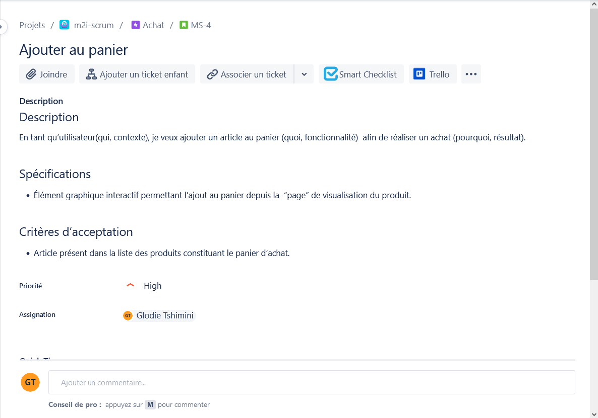
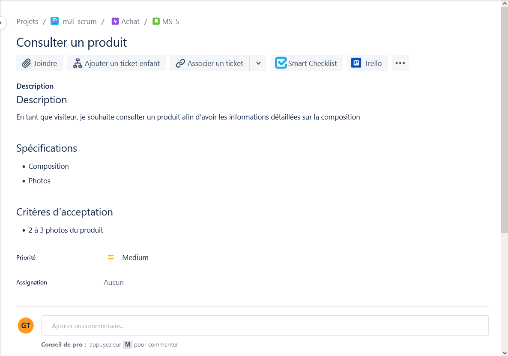
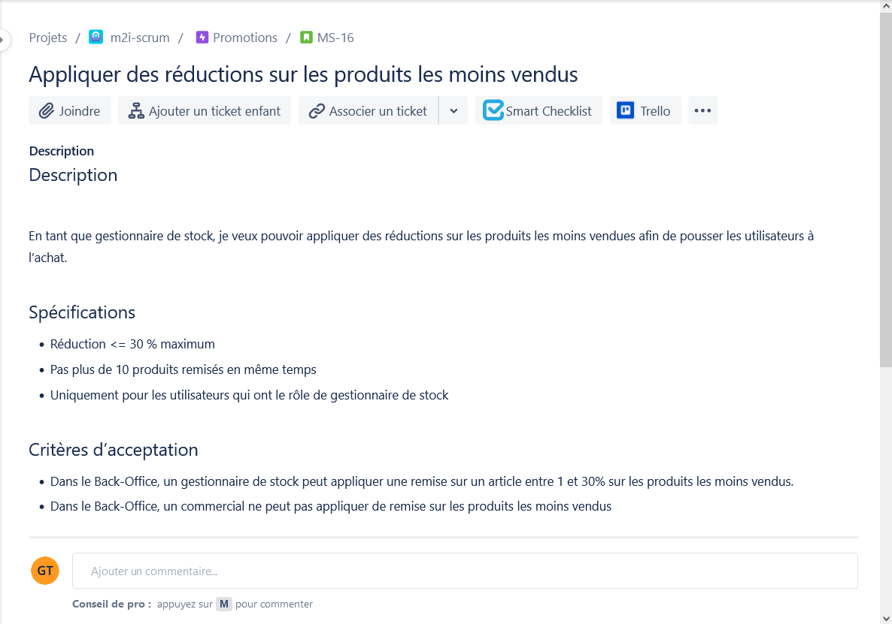

# Correction exercice 3 : backlog refinement

### Description et affinage de 3 *US*

Dans les spécifications, on peut mettre des précisions d'ordre fonctionnelle ou technique. Pour le *Product Owner* (*PO*) ça sera davantage d'ordre fonctionnelle et pour les devs techniques (sans rentrer trop dans les détails et sans donner la solution, il faut que l'*US* puisse être compris par tout le monde).

Le *backlog* est la responsabilité du PO cependant le travail à effectuer peut-être fait en équipe.

Les critères d'acceptation sont propres à chaque *US*, ce sont des éléments sur lesquels on peut s'appuyer pour affirmer que la fonctionnalité a bien été développé.

Le PO cherchera à maximiser la valeur du produit en menant des entretiens avec les utilisateurs finaux et proposer des wireframes (similaire à une maquette graphique mais avec beaucoup moins de détail) et des prototypes (un exemple du produit final avec lequel les utilisateurs peuvent interagir réalisé à l'aide d'un logiciel no-code destiné aux designers).

